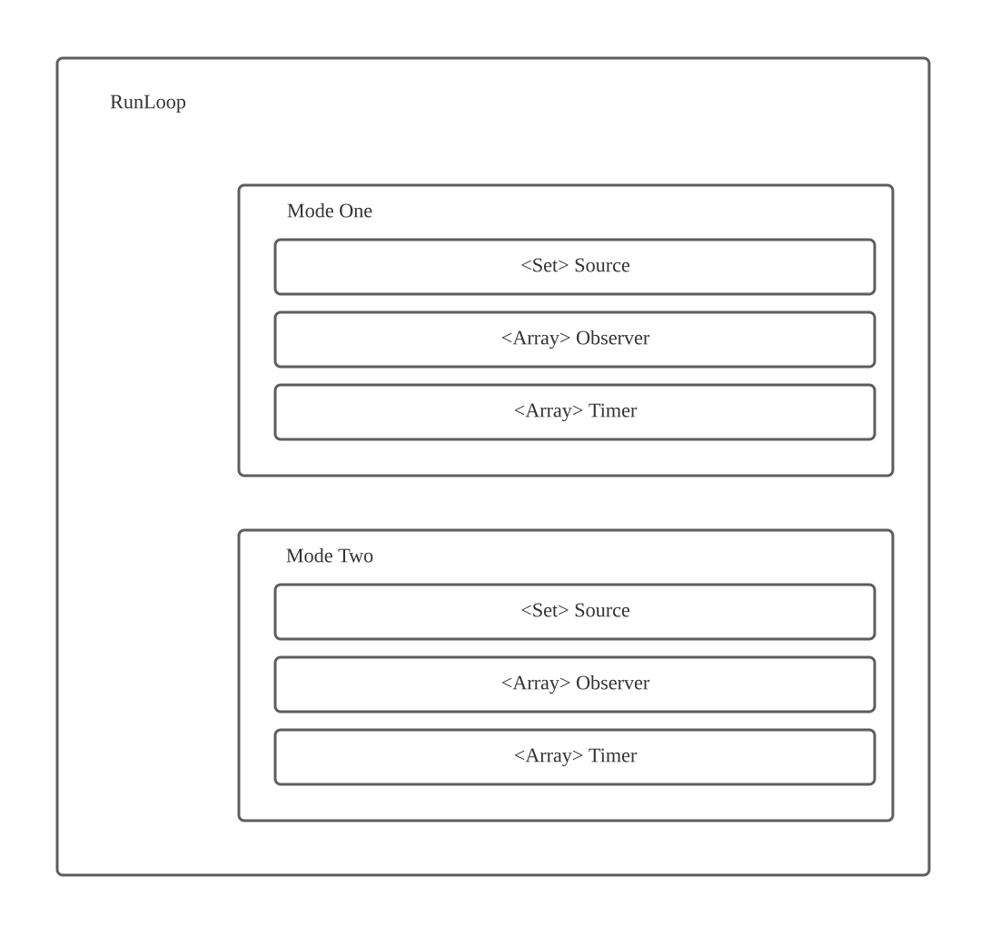

# Play Grounds
## References
[Apple Threading Programming Guide](https://developer.apple.com/library/archive/documentation/Cocoa/Conceptual/Multithreading/RunLoopManagement/RunLoopManagement.html)

[深入理解RunLoop](https://blog.ibireme.com/2015/05/18/runloop/)

----
- [Getting a Run Loop Object](#getting-a-run-loop-object)
- [Configuring the Run Loop](#configuring-the-run-loop)
  * [Create a run loop observer](#create-a-run-loop-observer)
  * [Create and schedule the timer.](#create-and-schedule-the-timer)
- [Starting the Run Loop](#starting-the-run-loop)
- [Existing the Run Loop](#existing-the-run-loop)
- [Thread Safety and Run Loop Objects](#thread-safety-and-run-loop-objects)
- [Configuring Run Loop Sources](#configuring-run-loop-sources)
  * [Defining a Custome Input Source](#defining-a-custome-input-source)

<small><i><a href='http://ecotrust-canada.github.io/markdown-toc/'>Table of contents generated with markdown-toc</a></i></small>

----
## RunLoop related Classes
In OSX/iOS System, there are two Classes supporting Run Loop: NSRunLoop and CFRunLoopRef
- CFRunLoopRef is inside CoreFoundation framework, it provided APIs purely built on C functions, all APIs are thread safe. All codes of CFRunLoopRef are open source, you could download the code from [http://opensource.apple.com/tarballs/CF/](http://opensource.apple.com/tarballs/CF/).
- NSRunLoop is built based on CFRunLoopRef, provided APIs for NSObjects, but those APIs are not thread safe, thus you should only manage NSRunLoop inside its own thread.

Thus, in order to understand how Run Loop works inside OSX/iOS System, we just need to understand how CFRunLoopRef works.

(P.S. after Swift become opensource, apple provided another version of CoreFoundation accross multiple platforms: [https://github.com/apple/swift-corelibs-foundation/](https://github.com/apple/swift-corelibs-foundation/))

### RunLoop inside CoreFoundation
There are five classes related to RunLoop inside CoreFoundation: CFRunLoopRef, CFRunLoopModeRef, CFRunLoopSourceRef,CFRunLoopTimerRef and CFRunLoopObserverRef. We could refer following diagram to give a brief understanding of the relationship of these classes.



One RunLoop Object contains several Modes, and for every modes, there are several Source/Timer/Observer assigned to that mode. Each time when RunLoop Object performing one loop, there will be one mode be choosed, and this mode called as CurrentMode, only Source, Observer and Timer belong to this mode will response to this run.

1. **CFRunLoopSourceRef** - Where event happens, and there are two type of sources -- source0 and source1 -- in every mode
    - **source0** -  only contains one pointer to the function, but it cannot trigger event happen. In order to trigger this source, user need to call CFRunLoopSourceSignal(source) to makr the source as signaled (the bits of the source to 1,1,1), and then call CFRunLoopWakeUp(runloop) to awake RunLoop, then this source will be performed.
    - **source1** - contains a mach_port and one pointer to the function, used for the communication with other threads. This source will wake RunLoop automatically.
2. **CFRunLoopTimerRef** - it is [toll-free bridged](https://developer.apple.com/library/archive/documentation/General/Conceptual/CocoaEncyclopedia/Toll-FreeBridgin/Toll-FreeBridgin.html) with NSTimer. Contains a time range and a pointer to the function. When it is added into RunLoop, RunLoop will register a time. While time reached, RunLoop will awaked to execute that function.
3. **CFRunLoopObserverRef** - every Observer contains one pointer to the function. While the status of RunLoop changed, Observer will callback this status changes.
```c++
typedef CF_OPTIONS(CFOptionFlags, CFRunLoopActivity) {
    kCFRunLoopEntry         = (1UL << 0), // Will enter a Loop
    kCFRunLoopBeforeTimers  = (1UL << 1), // Will handle Timer
    kCFRunLoopBeforeSources = (1UL << 2), // Will handle Source
    kCFRunLoopBeforeWaiting = (1UL << 5), // Will sleep
    kCFRunLoopAfterWaiting  = (1UL << 6), // Just Awake
    kCFRunLoopExit          = (1UL << 7), // Will terminated
}
```

All <Source/TImer/Observer> are mode items.
- An mode item could be added to multiple mode at the same time. But if you add same item into same mode, this item won't work twice.
- If current mode doesn't contains any item, RunLoop will skip the Loop directly.

### RunLoop Mode
The the structures of CFRunLoopMode and CFRunLoop show as following:
```c++
struct __CFRunLoop {
    CFRuntimeBase _base;
    pthread_mutex_t _lock;			/* locked for accessing mode list */
    __CFPort _wakeUpPort;			// used for CFRunLoopWakeUp 
    Boolean _unused;
    volatile _per_run_data *_perRunData;              // reset for runs of the run loop
    pthread_t _pthread;  // <<<<Every RunLoop is associtated with a pthread_t>>>>
    uint32_t _winthread;
    CFMutableSetRef _commonModes; // <<<<Plese notice these two property>>>>
    CFMutableSetRef _commonModeItems; // <<<<Plese notice these two property>>>>
    CFRunLoopModeRef _currentMode;
    CFMutableSetRef _modes;
    struct _block_item *_blocks_head;
    struct _block_item *_blocks_tail;
    CFAbsoluteTime _runTime;
    CFAbsoluteTime _sleepTime;
    CFTypeRef _counterpart;
};

struct __CFRunLoopMode {
    CFRuntimeBase _base;
    pthread_mutex_t _lock;	/* must have the run loop locked before locking this */
    CFStringRef _name;
    Boolean _stopped;
    char _padding[3];
    CFMutableSetRef _sources0;
    CFMutableSetRef _sources1;
    CFMutableArrayRef _observers;
    CFMutableArrayRef _timers;
    CFMutableDictionaryRef _portToV1SourceMap;
    __CFPortSet _portSet;
    CFIndex _observerMask;
#if USE_DISPATCH_SOURCE_FOR_TIMERS
    dispatch_source_t _timerSource;
    dispatch_queue_t _queue;
    Boolean _timerFired; // set to true by the source when a timer has fired
    Boolean _dispatchTimerArmed;
#endif
#if USE_MK_TIMER_TOO
    mach_port_t _timerPort;
    Boolean _mkTimerArmed;
#endif
#if DEPLOYMENT_TARGET_WINDOWS
    DWORD _msgQMask;
    void (*_msgPump)(void);
#endif
    uint64_t _timerSoftDeadline; /* TSR */
    uint64_t _timerHardDeadline; /* TSR */
};
```
There is one concept called "CommonModes": a ModeName could be added into "commonModes" to mark it as "Common" -- While the content of RunLoop changed, RunLoop will automatically allocate items inside _commonModelItems into all Modes marked as "Common".

**For example:** There are two pre-set modes inside the run loop of main thread: kCFRunLoopDefaultMode(*tracking the default status of the application*) and UITrackingRunLoopMode(*tracking the status while ScrllView is scrolling*). Both of them have already be marked as "Common". If you want to create a timer which could be triggered in both Mode. Instead of adding this timer into both mode directly, you could also add this timer into "commonModelItems".

There are only two public methods to manage Modes inside CFRunLoop:
```c++
CFRunLoopAddCommonMode(CFRunLoopRef runloop, CFStringRef modeName);
CFRunLoopRunInMode(CFStringRef modeName, ...);
```
And here are several methods to manage modes inside CFRunLoop:
```c++
CFRunLoopAddSource(CFRunLoopRef rl, CFRunLoopSourceRef source, CFStringRef modeName);
CFRunLoopAddObserver(CFRunLoopRef rl, CFRunLoopObserverRef observer, CFStringRef modeName);
CFRunLoopAddTimer(CFRunLoopRef rl, CFRunLoopTimerRef timer, CFStringRef mode);
CFRunLoopRemoveSource(CFRunLoopRef rl, CFRunLoopSourceRef source, CFStringRef modeName);
CFRunLoopRemoveObserver(CFRunLoopRef rl, CFRunLoopObserverRef observer, CFStringRef modeName);
CFRunLoopRemoveTimer(CFRunLoopRef rl, CFRunLoopTimerRef timer, CFStringRef mode);
```
If the modeName doesn't exist, the RunLoop will create CFRunLoopModeRef for you automatically. And for an RunLoop Object, there is no method to remove CFRunLoopModeRef.
----
## Getting a Run Loop Object
### How to simply access RunLoops
1. In a Cocoa application, NSRunLoop Class is use
```objective-c
    NSRunLoop* myRunLoop = [NSRunLoop currentRunLoop];
```
2. Or could use CFRunLoop
```objective-c
    NSRunLoop* myRunLoop = [NSRunLoop currentRunLoop];
    CFRunLoopRef myRunLoopRef = [myRunLoop getCFRunLoop];
    /// or
    CFRunLoopRef runLoopRef = CFRunLoopGetCurrent();
```
### Further Discussion
Apple won't allow user directly create RunLoop, it only provides two functions inside CFRunLoopRef: CFRunLoopGetMain() and CFRunLoopGetCurrent(). We could find out the logics to achieve these two functions similar to the following codes:
```c++
/// An global dictionary, <pthread_t : CFRunLoopRef>
static CFMutableDictionaryRef loopsDic;
/// An splin lock for accessing run loops
static CFSpinLock_t loopsLock;
 
/// A method to get a runloop from a thread
CFRunLoopRef _CFRunLoopGet(pthread_t thread) {
    OSSpinLockLock(&loopsLock);
    
    if (!loopsDic) {
        // First time calle this method, initial loopsDict and initial an runloop for main thread。
        loopsDic = CFDictionaryCreateMutable();
        CFRunLoopRef mainLoop = _CFRunLoopCreate();
        CFDictionarySetValue(loopsDic, pthread_main_thread_np(), mainLoop);
    }
    
    /// Try to get value from global dictionary。
    CFRunLoopRef loop = CFDictionaryGetValue(loopsDic, thread));
    
    if (!loop) {
        /// If we cannot gat a loop value, we will create the run loop and store it in loopsDict
        loop = _CFRunLoopCreate();
        CFDictionarySetValue(loopsDic, thread, loop);
        /// Register a callback, if the thread is termianted, we will also terminate related RunLoop。
        _CFSetTSD(..., thread, loop, __CFFinalizeRunLoop);
    }
    
    OSSpinLockUnLock(&loopsLock);
    return loop;
}
 
CFRunLoopRef CFRunLoopGetMain() {
    return _CFRunLoopGet(pthread_main_thread_np());
}
 
CFRunLoopRef CFRunLoopGetCurrent() {
    return _CFRunLoopGet(pthread_self());
}
```

## Configuring the Run Loop
>Before you run a run loop on a secondary thread, you must add at least one input source or timer to it. If a run loop does not have any sources to monitor, it exits immediately when you try to run it. 

- If there is no source to monitor, run loop will exit immediately.

>When configuring the run loop for a long-lived thread, it is better to add at least one input source to receive messages. Although you can enter the run loop with only a timer attached, once the timer fires, it is typically invalidated, which would then cause the run loop to exit. Attaching a repeating timer could keep the run loop running over a longer period of time, but would involve firing the timer periodically to wake your thread, which is effectively another form of polling. By contrast, an input source waits for an event to happen, keeping your thread asleep until it does.

- A repeated timer could keep wake your thread.

### Create a run loop observer
```objective-c
- (void)addAnObserver
{
    CFRunLoopRef currentRunLoop = CFRunLoopGetCurrent();
    
    // Create a run loop observer and attach it to the run loop.
    CFRunLoopObserverContext  context = {0, (__bridge void *)self, NULL, NULL, NULL};
    CFRunLoopObserverRef    observer = CFRunLoopObserverCreate(kCFAllocatorDefault,
                                                               kCFRunLoopAllActivities, YES, 0, &myRunLoopObserver, &context);
    
    if (observer) {
        CFRunLoopAddObserver(currentRunLoop, observer, kCFRunLoopDefaultMode);
    }
}

static void myRunLoopObserver(CFRunLoopObserverRef observer, CFRunLoopActivity activity, void *info){
    KNVRunLoopPlayGroundModel *model = (__bridge KNVRunLoopPlayGroundModel *)(info); // info is my self
    NSLog(@"activity = %lu", activity);
    NSLog(@"runLoopOserverCallBack -> model = %@",model);
}
```

### Create and schedule the timer.
```objective-c
- (void)addAndScheduleATimer
{
    NSRunLoop* myRunLoop = [NSRunLoop currentRunLoop];
    
    // Create and schedule the timer.
    [NSTimer scheduledTimerWithTimeInterval:0.1 target:self
                                   selector:@selector(doFireTimer:) userInfo:nil repeats:YES];
    
    NSInteger    loopCount = 10;
    do
    {
        // Run the run loop 10 times to let the timer fire.
        [myRunLoop runUntilDate:[NSDate dateWithTimeIntervalSinceNow:1]];
        loopCount--;
    }
    while (loopCount);
}

- (void)doFireTimer:(NSTimer *)timer
{
    NSLog(@"Fireing Timer");
}
```

## Starting the Run Loop
>Starting the run loop is necessary only for the secondary threads in your application. A run loop must have at least one input source or timer to monitor. If one is not attached, the run loop exits immediately.

>There are several ways to start the run loop, including the following:
>- **Unconditionally:** Which is the easilest, but will cause you lost the control of run loop itself. You can add and remove input sources and timers, but the only way to stop the run loop is to kill it. There is also no way to run the run loop in a custom mode.
>- **With a set time limit:** When you use a timeout value, the run loop runs until an event arrives or the allotted time expires. If an event arrives, that event is dispatched to a handler for processing and then the run loop exits. Your code can then restart the run loop to handle the next event. If the allotted time expires instead, you can simply restart the run loop or use the time to do any needed housekeeping.
>- **In a particular mode:** In addition to timeout value, you can also run your run loop using a specific mode.

```objective-c
typedef CF_ENUM(SInt32, CFRunLoopRunResult) {
    kCFRunLoopRunFinished = 1,
    kCFRunLoopRunStopped = 2,
    kCFRunLoopRunTimedOut = 3,
    kCFRunLoopRunHandledSource = 4
};

- (void)skeletonThreadMain
{
    // Set up an autorelease pool here if not using garbage collection.
    BOOL done = NO;
 
    // Add your sources or timers to the run loop and do any other setup.
 
    do
    {
        // Start the run loop but return after each source is handled.
        SInt32    result = CFRunLoopRunInMode(kCFRunLoopDefaultMode, 10, YES);
 
        // If a source explicitly stopped the run loop, or if there are no
        // sources or timers, go ahead and exit.
        if ((result == kCFRunLoopRunStopped) || (result == kCFRunLoopRunFinished))
            done = YES;
 
        // Check for any other exit conditions here and set the
        // done variable as needed.
    }
    while (!done);
 
    // Clean up code here. Be sure to release any allocated autorelease pools.
}
```
>It is possible to run a run loop recursively. In other words, you can call CFRunLoopRun, CFRunLoopRunInMode, or any of the NSRunLoop methods for starting the run loop from within the handler routine of an input source or timer. When doing so, you can use any mode you want to run the nested run loop, including the mode in use by the outer run loop
- **TODO:** Not very sure about the deatils of this part. From my understanding, CFRunLoopRun or CFRunLoopRunInMode could keep run current run loop (for one full circle of current run loop?). And we could add events to the Run Loop, and then keep call the method to run that Run Loop, until it finished or stopped, the we could release the resources.

## Existing the Run Loop
>There are two ways to make a run loop exit before it has processed an event:
>- Configure the run loop to run with a timeout value.
>- Tell the run loop to stop.

>Using a timeout value is certainly preferred, if you can manage it. Specifying a timeout value lets the run loop finish all of its normal processing, including delivering notifications to run loop observers, before exiting.

>Stopping the run loop explicitly with the CFRunLoopStop function produces a result similar to a timeout. The run loop sends out any remaining run-loop notifications and then exits. The difference is that you can use this technique on run loops you started unconditionally.

>Although removing a run loop’s input sources and timers may also cause the run loop to exit, this is **NOT** a reliable way to stop a run loop. Some system routines add input sources to a run loop to handle needed events. Because your code might not be aware of these input sources, it would be unable to remove them, which would prevent the run loop from exiting.

## Thread Safety and Run Loop Objects
>Thread safety varies depending on which API you are using to manipulate your run loop. The functions in Core Foundation are generally thread-safe and can be called from any thread. **If you are performing operations that alter the configuration of the run loop, however, it is still good practice to do so from the thread that owns the run loop whenever possible**.

>The Cocoa **NSRunLoop** class is **NOT** as inherently thread safe as its Core Foundation counterpart. If you are using the NSRunLoop class to modify your run loop, you should do so only from the same thread that owns that run loop. Adding an input source or timer to a run loop belonging to a different thread could cause your code to crash or behave in an unexpected way.

## Configuring Run Loop Sources
### Defining a Custome Input Source
> Creating a custom input source involves defining the following:
>- The information you want your input source to process.
>- A scheduler routine to let interested clients know how to contact your input source.
>- A handler routine to perform requests sent by any clients.
>- A cancellation routine to invalidate your input source.

> Because you create a custom input source to process custom information, the actual configuration is designed to be flexible. The scheduler, handler, and cancellation routines are the key routines you almost always need for your custom input source.  Most of the rest of the input source behavior, however, happens outside of those handler routines. For example, it is up to  you to define the mechanism for passing data to your input source and for communicating the presence of your input source to other threads.


>Figure 3-2 shows a sample configuration of a custom input source. In this example, the application’s main thread maintains references to the input source, the custom command buffer for that input source, and the run loop on which the input source is installed. When the main thread has a task it wants to hand off to the worker thread, it posts a command to the command buffer along with any information needed by the worker thread to start the task. (Because both the main thread and the input source of the worker thread have access to the command buffer, that access must be synchronized.) Once the command is posted, the main thread signals the input source and wakes up the worker thread’s run loop. Upon receiving the wake up command, the run loop calls the handler for the input source, which processes the commands found in the command buffer.