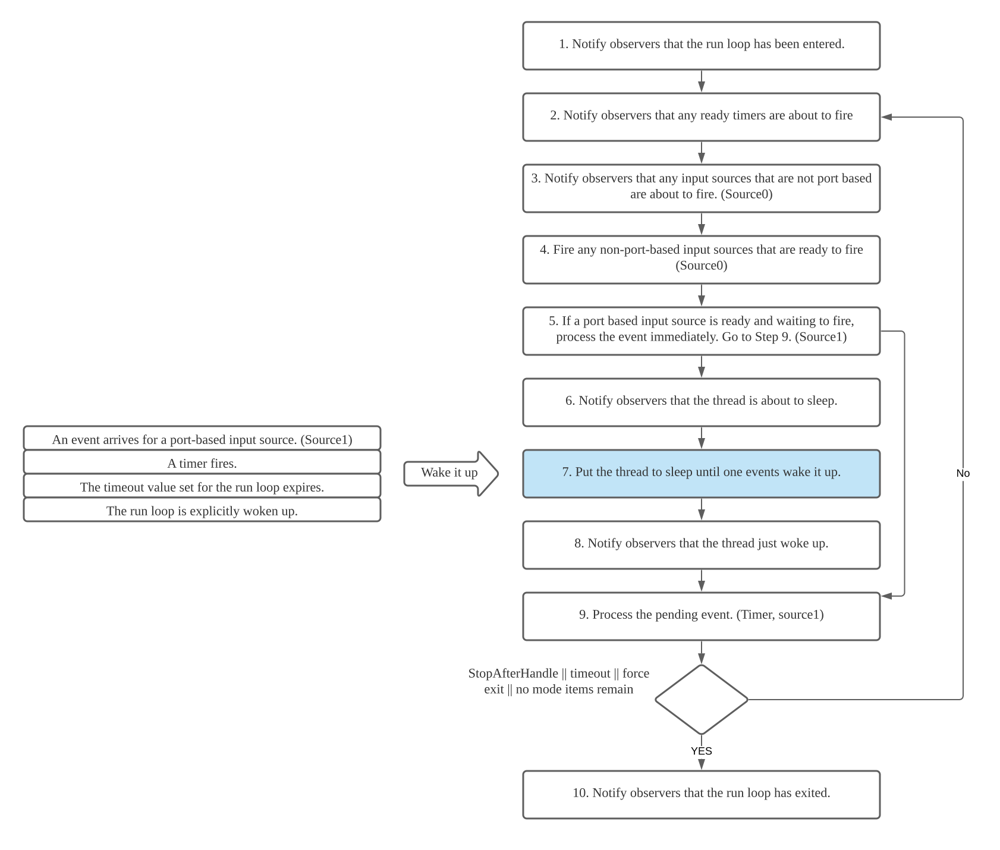
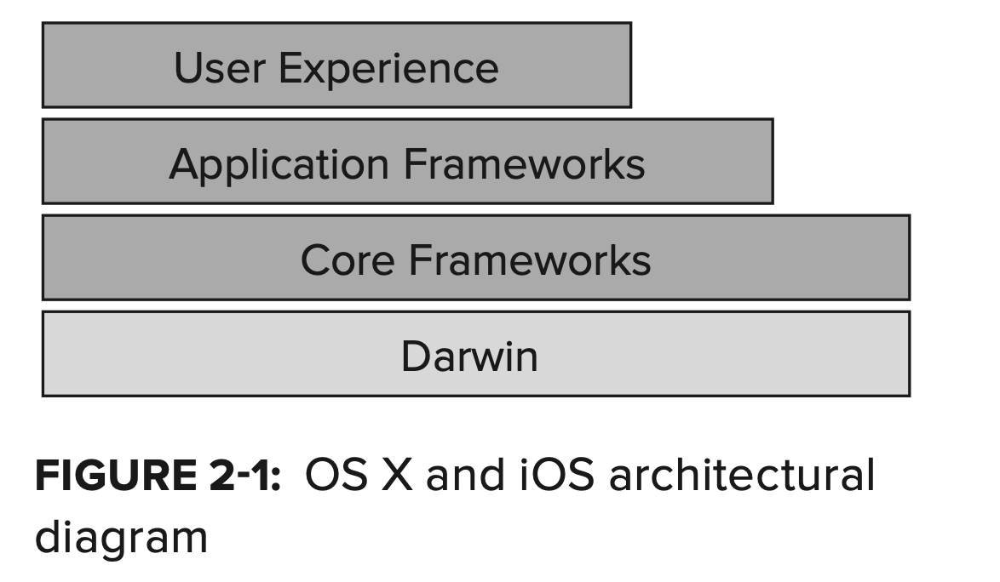
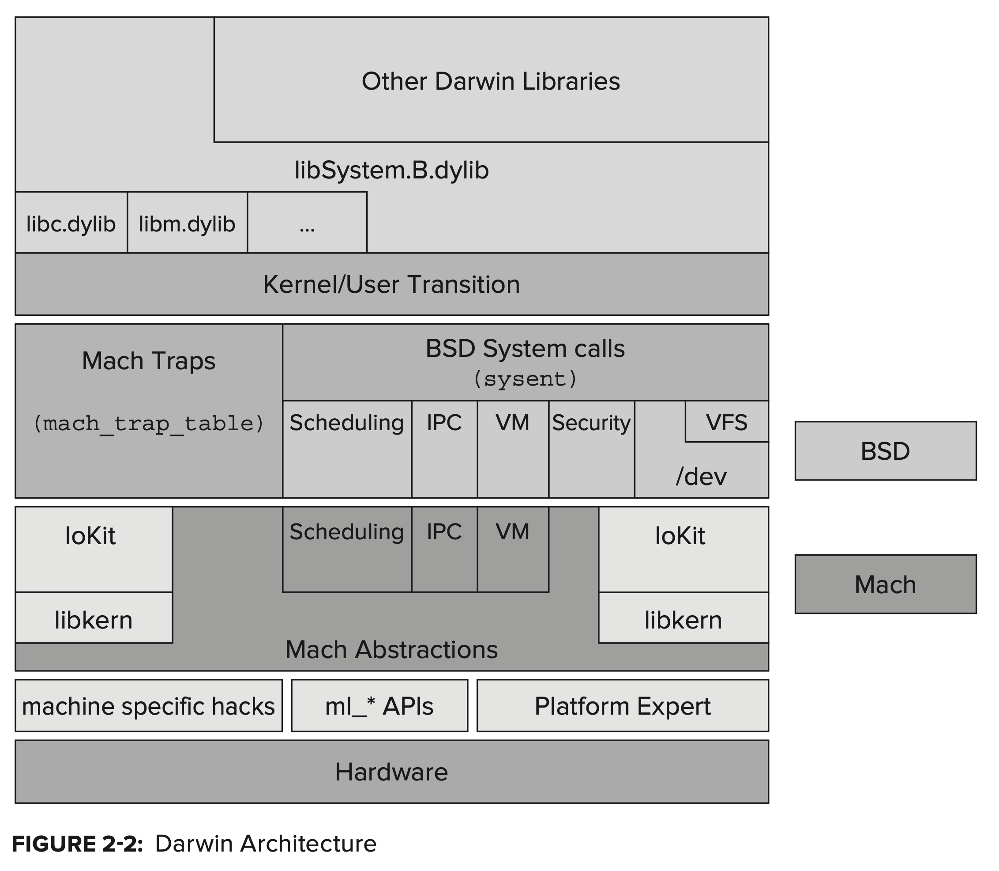
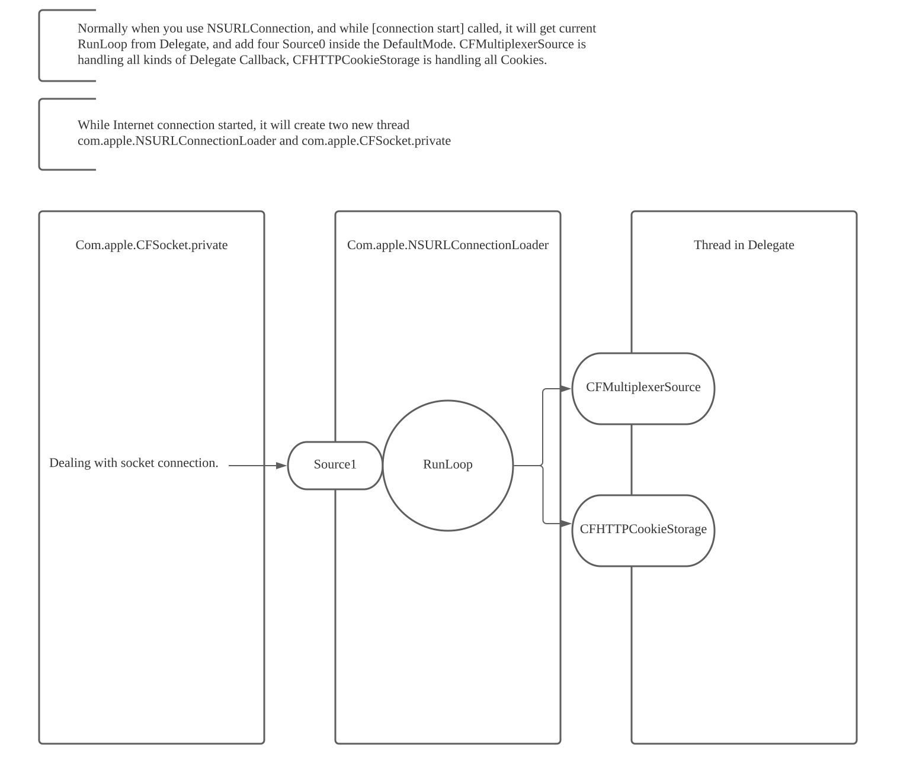

# Run Loops
## References
[Apple Threading Programming Guide](https://developer.apple.com/library/archive/documentation/Cocoa/Conceptual/Multithreading/RunLoopManagement/RunLoopManagement.html)

[iOS 多线程：『RunLoop』详尽总结](https://bujige.net/blog/iOS-Complete-learning-RunLoop.html)

[深入理解RunLoop](https://blog.ibireme.com/2015/05/18/runloop/)

[Mac OS X and iOS Internals](http://newosxbook.com/MOXiI.pdf)

----
- [What is "Run Loops"](#what-is--run-loops-)
- [Anatomy of a Run Loop](#anatomy-of-a-run-loop)
  * [Run Loop Modes](#run-loop-modes)
  * [Input Sources](#input-sources)
    + [Port-Based Sources](#port-based-sources)
    + [Custom Input Sources](#custom-input-sources)
    + [Cocoa Perform Selector Sources](#cocoa-perform-selector-sources)
  * [Timer Sources](#timer-sources)
  * [Run Loop Observers](#run-loop-observers)
- [How RunLoop works inside main thread](#how-runloop-works-inside-main-thread)
- [The Run Loop Sequence of Events](#the-run-loop-sequence-of-events)
- [How RunLoop is achieved in OSX/IOS System](#how-runloop-is-achieved-in-osx-ios-system)
  * [OS X and iOS architectural diagram](#os-x-and-ios-architectural-diagram)
- [Example of RunLoop in main thread](#example-of-runloop-in-main-thread)
  * [AutoreleasePool](#autoreleasepool)
  * [React to Events](#react-to-events)
  * [Gestrure Recognize](#gestrure-recognize)
  * [UI Updating](#ui-updating)
  * [Timer](#timer)
  * [PerformSelecter](#performselecter)
  * [About GCD](#about-gcd)
  * [About Network Request](#about-network-request)
- [When Would You Use a Run Loop?](#when-would-you-use-a-run-loop-)

<small><i><a href='http://ecotrust-canada.github.io/markdown-toc/'>Table of contents generated with markdown-toc</a></i></small>


----

## What is "Run Loops"
>Run loops are part of the fundamental infrastructure associated with threads. A run loop is an event processing loop that you use to schedule work and coordinate the receipt of incoming events. The purpose of a run loop is to keep your thread busy when there is work to do and put your thread to sleep when there is none.

>Run loop management is not entirely automatic. You must still design your thread’s code to start the run loop at appropriate times and respond to incoming events. Both Cocoa and Core Foundation provide run loop objects to help you configure and manage your thread’s run loop. Your application does not need to create these objects explicitly; each thread, including the application’s main thread, has an associated run loop object. Only secondary threads need to run their run loop explicitly, however. The app frameworks automatically set up and run the run loop on the main thread as part of the application startup process.

Normally, a thread could only process one round of tasks, and after the task finished, the thread will quit. If we want a thread could keep dealing with events without quit, we could use a design pattern called [Event Loop](https://en.wikipedia.org/wiki/Event_loop). The code to achieve it could simply be:
```c++ 
function loop() {
    initialize();
    do {
        var message = get_next_message();
        process_message(message);
    } while (message != quit);
}
```
 
- As its literally meaning, RunLoop is a loop which is running. Which is an object processing all kinds of events which could ensure theprocess could keep prcoessing properly.
- If there is nonthing to process, it will send threads into sleep mode, which will save the CPU resources and improve effiency.
- RunLoop and Threads -- "*OS X and iOS provide built-in support for implementing run loops in every thread*"
  - Every threads will have and only have one RunLoop Object inside. (Unless it's a secondary thread, every threads will manage a run loop for themselves automatically)
  - RunLoop is not thread-safe, we should only manage the runloop of current thread inside current thread. We shouldn't manage the runloops of other threads inside current thread.
  - RunLoop object is created at the first time when you access it. and will be terminated while the thread ended.

----
## Anatomy of a Run Loop
**TODO:** Not very sure what is this mean, yet... might need to come back to this topic after I go through th document.
>A run loop is very much like its name sounds. It is a loop your thread enters and uses to run event handlers in response to incoming events. Your code provides the control statements used to implement the actual loop portion of the run loop—in other words, your code provides the while or for loop that drives the run loop. Within your loop, you use a run loop object to "run” the event-processing code that receives events and calls the installed handlers.

>A run loop receives events from two different types of sources. Input sources deliver asynchronous events, usually messages from another thread or from a different application. Timer sources deliver synchronous events, occurring at a scheduled time or repeating interval. Both types of source use an application-specific handler routine to process the event when it arrives.

>Figure 3-1 shows the conceptual structure of a run loop and a variety of sources. The input sources deliver asynchronous events to the corresponding handlers and cause the runUntilDate: method (called on the thread’s associated NSRunLoop object) to exit. Timer sources deliver events to their handler routines but do not cause the run loop to exit.


Here is my understanding to Figure 3 - 1
- The Run Loop is a while or for loop inside a thread.
- We have two ways to pass event the run loop
    - Input sources, Figure describes three types of Input Sources - Port-Base Sources, Custom Input Sources and Cocoa Perform Selector Sources.
    - Timer sources (Feeling it is related to Timers)
- Not sure why Input sources could cause to exit, but timer sources won't cause to exit.

>In addition to handling sources of input, run loops also generate notifications about the run loop’s behavior. Registered run-loop observers can receive these notifications and use them to do additional processing on the thread. You use Core Foundation to install run-loop observers on your threads.

We could also handle the notifications about the run loop's behaviour.

### Run Loop Modes
>A run loop mode is a collection of input sources and timers to be monitored and a collection of run loop observers to be notified. Each time you run your run loop, you specify (either explicitly or implicitly) a particular “mode” in which to run. During that pass of the run loop, only sources associated with that mode are monitored and allowed to deliver their events. (Similarly, only observers associated with that mode are notified of the run loop’s progress.) Sources associated with other modes hold on to any new events until subsequent passes through the loop in the appropriate mode.

- **Definition:** Mode is a collection of input sources and timers to be monitored and a collection of run loop observers to be notified. 
- Each time while running run loop, we nee specify a particular "mode". <- Each time you run your run loop called **"the pass of the run loop"**
- In every pass, only source associated with that mode will be monitored and allowed to deliver their events, similar to observers.

>In your code, you identify modes by name. Both Cocoa and Core Foundation define a default mode and several commonly used modes, along with strings for specifying those modes in your code. You can define custom modes by simply specifying a custom string for the mode name. Although the names you assign to custom modes are arbitrary, the contents of those modes are not. You must be sure to add one or more input sources, timers, or run-loop observers to any modes you create for them to be useful.

- Developers identify modes by name (just custom string). There are Default Modes, we could find these Default Modes in [Apple Threading Programming Guide](https://developer.apple.com/library/archive/documentation/Cocoa/Conceptual/Multithreading/RunLoopManagement/RunLoopManagement.html).
- Developers need to ensure modes useful.

>You use modes to filter out events from unwanted sources during a particular pass through your run loop. Most of the time, you will want to run your run loop in the system-defined “default” mode. A modal panel, however, might run in the “modal” mode. While in this mode, only sources relevant to the modal panel would deliver events to the thread. For secondary threads, you might use custom modes to prevent low-priority sources from delivering events during time-critical operations.

- Modes are used to filter events dlivered to the thread.

### Input Sources
>Input sources deliver events asynchronously to your threads. The source of the event depends on the type of the input source, which is generally one of two categories. Port-based input sources monitor your application’s Mach ports. Custom input sources monitor custom sources of events. As far as your run loop is concerned, it should not matter whether an input source is port-based or custom. The system typically implements input sources of both types that you can use as is. The only difference between the two sources is how they are signaled. Port-based sources are signaled automatically by the kernel, and custom sources must be signaled manually from another thread.

Feeling it's related to deeper level structures... Not very clear...

- **Most Important:** Input sources deliver events asynchronously to your threads.
- Port-based sources are signaled automatically by the kernel.
- Custom sources must be signaled manually from another thread.

>When you create an input source, you assign it to one or more modes of your run loop. Modes affect which input sources are monitored at any given moment. Most of the time, you run the run loop in the default mode, but you can specify custom modes too. If an input source is not in the currently monitored mode, any events it generates are held until the run loop runs in the correct mode.

#### Port-Based Sources
>Cocoa and Core Foundation provide built-in support for creating port-based input sources using port-related objects and functions. For example, in Cocoa, you never have to create an input source directly at all. You simply create a port object and use the methods of NSPort to add that port to the run loop. The port object handles the creation and configuration of the needed input source for you.

>In Core Foundation, you must manually create both the port and its run loop source. In both cases, you use the functions associated with the port opaque type (CFMachPortRef, CFMessagePortRef, or CFSocketRef) to create the appropriate objects.

#### Custom Input Sources
>To create a custom input source, you must use the functions associated with the CFRunLoopSourceRef opaque type in Core Foundation. You configure a custom input source using several callback functions. Core Foundation calls these functions at different points to configure the source, handle any incoming events, and tear down the source when it is removed from the run loop.

>In addition to defining the behavior of the custom source when an event arrives, you must also define the event delivery mechanism. This part of the source runs on a separate thread and is responsible for providing the input source with its data and for signaling it when that data is ready for processing. The event delivery mechanism is up to you but need not be overly complex.

#### Cocoa Perform Selector Sources
>In addition to port-based sources, Cocoa defines a custom input source that allows you to perform a selector on any thread. Like a port-based source, perform selector requests are serialized on the target thread, alleviating many of the synchronization problems that might occur with multiple methods being run on one thread. Unlike a port-based source, a perform selector source removes itself from the run loop after it performs its selector.

- NSObject provide many methods to allow user to perform a selector on any thread.
- A perform selector source removes itself from the run loop after it performs its selectoer

>When performing a selector on another thread, the target thread must have an active run loop. For threads you create, this means waiting until your code explicitly starts the run loop. Because the main thread starts its own run loop, however, you can begin issuing calls on that thread as soon as the application calls the applicationDidFinishLaunching: method of the application delegate. The run loop processes all queued perform selector calls each time through the loop, rather than processing one during each loop iteration.

- The selector passed to another thread will perform only when the target thread having an active run loop. (**TODO:** what is active means in here?)
- Main thread starts its own run loop as soon as the application calls the the applicationDidFinishLaunching: method of the application delegate.
- The run loop will processes all queued perform selector calls each time throught the loop, not just one during each loop iteration. (Happened in one loop one by one, based on the understanding of **The Run Loop Sequence of Events**)

There are a table about NSObject methods in [Apple Threading Programming Guide](https://developer.apple.com/library/archive/documentation/Cocoa/Conceptual/Multithreading/RunLoopManagement/RunLoopManagement.html).

- There is one parameter called waitUntilDone: to control the synchronization, even though all input source are added asynchronously
- performSelector:withObject:afterDelay: 
    - Because it will run in next run loop cycle, these methods will provide an automatic mini delay from the currently executing code.
    - Multiple queued selections are performed one after another in the order they were queued 

### Timer Sources
>Timer sources deliver events synchronously to your threads at a preset time in the future. Timers are a way for a thread to notify itself to do something. For example, a search field could use a timer to initiate an automatic search once a certain amount of time has passed between successive key strokes from the user. The use of this delay time gives the user a chance to type as much of the desired search string as possible before beginning the search.

- Timer sources deliver events synchronously to your threads at a preset time in the future.

>Although it generates time-based notifications, a timer is not a real-time mechanism. Like input sources, timers are associated with specific modes of your run loop. If a timer is not in the mode currently being monitored by the run loop, it does not fire until you run the run loop in one of the timer’s supported modes. Similarly, if a timer fires when the run loop is in the middle of executing a handler routine, the timer waits until the next time through the run loop to invoke its handler routine. If the run loop is not running at all, the timer never fires.

- Timer sources will also controlled by modes. And will only fire if the run loop is running.
- If a timer fires when the run loop is in the middle of executing a handler routine, the timer waits until the next time through the run loop to invoke its handler routine. (My understanding, **"fire"** in here means timer add event into the thread -- fire also could wake run loop up.)

>You can configure timers to generate events only once or repeatedly. A repeating timer reschedules itself automatically based on the scheduled firing time, not the actual firing time. For example, if a timer is scheduled to fire at a particular time and every 5 seconds after that, the scheduled firing time will always fall on the original 5 second time intervals, even if the actual firing time gets delayed. If the firing time is delayed so much that it misses one or more of the scheduled firing times, the timer is fired only once for the missed time period. After firing for the missed period, the timer is rescheduled for the next scheduled firing time.

- The timer will keep try to fire based on the original time intervals, not based on the time intervals since the latest fire time. 
- Unless the fire time is delayed so much that it misses one or more of the scheduled firing times, the timer is fired only once for the missed time period. After firing for the missed period, the timer is rescheduled for the next scheduled firing time.

### Run Loop Observers
Observers are just give developer chances to monitor the run loops, or monitor the sources user passed into the run loop. Here are the events you could observe:
>- The entrance to the run loop.
>- When the run loop is about to process a timer.
>- When the run loop is about to process an input source.
>- When the run loop is about to go to sleep.
>- When the run loop has woken up, but before it has processed the event that woke it up.
>- The exit from the run loop.

>You can add run loop observers to apps using Core Foundation. To create a run loop observer, you create a new instance of the CFRunLoopObserverRef opaque type. This type keeps track of your custom callback function and the activities in which it is interested.

>Similar to timers, run-loop observers can be used once or repeatedly. A one-shot observer removes itself from the run loop after it fires, while a repeating observer remains attached. You specify whether an observer runs once or repeatedly when you create it.

----
## How RunLoop works inside main thread
While we run an iOS application, system will run main.m file which generated by XCode while you create the project:
```objectiv-c
int main(int argc, char * argv[]) {
    @autoreleasepool {
        return UIApplicationMain(argc, argv, nil, NSStringFromClass([AppDelegate class]));
    }
}
```
Inside which, UIApplicationMain func help us created the RunLoop for main thread. You could simply understand that there is an endless loop inside UIApplicationMain, similar to:
```objective-c
int main(int argc, char * argv[]) {        
    BOOL running = YES;
    do {
        // keep processing codes..
        // ......
    } while (running);  // checking should end it or not
    return 0;
}
```
----
## The Run Loop Sequence of Events
Here is the cleaned codes inside CFRunLoopRef which used to achieve Run Loop: (you could download the code from [http://opensource.apple.com/tarballs/CF/](http://opensource.apple.com/tarballs/CF/).)
```c++
/// Used for run in default mode
void CFRunLoopRun(void) {
    CFRunLoopRunSpecific(CFRunLoopGetCurrent(), kCFRunLoopDefaultMode, 1.0e10, false);
}
 
/// Used to run a specifica mode with timeout time configurable
int CFRunLoopRunInMode(CFStringRef modeName, CFTimeInterval seconds, Boolean stopAfterHandle) {
    return CFRunLoopRunSpecific(CFRunLoopGetCurrent(), modeName, seconds, returnAfterSourceHandled);
}
 
/// The code to achieve Run Loop.
int CFRunLoopRunSpecific(runloop, modeName, seconds, stopAfterHandle) {
    
    /// Find the CFRunLoopModeRef based on modeName
    CFRunLoopModeRef currentMode = __CFRunLoopFindMode(runloop, modeName, false);
    /// If there is no <Source/Timer/Observer> inside CFRunLoopModeRef, will return directly.
    if (__CFRunLoopModeIsEmpty(currentMode)) return;
    
    /// 1. Notify observers will entry RunLoop
    __CFRunLoopDoObservers(runloop, currentMode, kCFRunLoopEntry);
    
    /// Run inside RunLoop
    __CFRunLoopRun(runloop, currentMode, seconds, returnAfterSourceHandled) {
        
        Boolean sourceHandledThisLoop = NO;
        int retVal = 0;
        do {
 
            /// 2. Notify observers, will call timers。
            __CFRunLoopDoObservers(runloop, currentMode, kCFRunLoopBeforeTimers);
            /// 3. Notify observers, will call Source0 (non-port)
            __CFRunLoopDoObservers(runloop, currentMode, kCFRunLoopBeforeSources);
            /// execute all blocks
            __CFRunLoopDoBlocks(runloop, currentMode);
            
            /// 4. RunLoop check source0, if source0 is Signaled, will unsetSignaled and add it into blocks。
            sourceHandledThisLoop = __CFRunLoopDoSources0(runloop, currentMode, stopAfterHandle);
            /// execute new added blocks
            __CFRunLoopDoBlocks(runloop, currentMode);
 
            /// 5. If contains Source1 (port-based) with ready will handle this Source1 and go to handle_msg
            if (__Source0DidDispatchPortLastTime) {
                Boolean hasMsg = __CFRunLoopServiceMachPort(dispatchPort, &msg)
                if (hasMsg) goto handle_msg;
            }
            
            /// 6. If no source handled in this loop, will notify Observers that the runloop will go to sleep.。
            if (!sourceHandledThisLoop) {
                __CFRunLoopDoObservers(runloop, currentMode, kCFRunLoopBeforeWaiting);
            }
            
            /// 7. using mach_msg waiting for msg from mach_port. thread will sleep until one of the following event happened. (Code in here is more complicated than what show below)
            /// • a new source1 (port-based) coming。
            /// • a timer time reached
            /// • Runloop time out.
            /// • other manually awake
            __CFRunLoopServiceMachPort(waitSet, &msg, sizeof(msg_buffer), &livePort, poll ? 0 : TIMEOUT_INFINITY, &voucherState, &voucherCopy); // There is a mach_msg() method call inside.
 
            /// 8. Notify observers, RunLoop just be waked up.
            __CFRunLoopDoObservers(runloop, currentMode, kCFRunLoopAfterWaiting);
            
            /// the start point of handle_msg。
            handle_msg:
 
            /// 9.1 If it's the time of a timer reached, will trigger the timer. Add the timer's callback into blocks??? feeling the Observer for kCFRunLoopBeforeTimers is not accurate to the following up repeated events.
            if (msg_is_timer) {
                __CFRunLoopDoTimers(runloop, currentMode, mach_absolute_time())
            } 
 
            /// 9.2 serviceing the main dispatch queue??
            else if (livePort == dispatchPort) {
                __CFRUNLOOP_IS_SERVICING_THE_MAIN_DISPATCH_QUEUE__(msg);
            } 
 
            /// 9.3 If it's a source1 (port-based) source send out the msg, will handle this source.
            else {
                CFRunLoopSourceRef source1 = __CFRunLoopModeFindSourceForMachPort(runloop, currentMode, livePort);
                sourceHandledThisLoop = __CFRunLoopDoSource1(runloop, currentMode, source1, msg);
                if (sourceHandledThisLoop) {
                    mach_msg(reply, MACH_SEND_MSG, reply);
                }
            }
            
            /// execute new added blocks
            __CFRunLoopDoBlocks(runloop, currentMode);
            
 
            if (sourceHandledThisLoop && stopAfterHandle) {
                /// stop after handle
                retVal = kCFRunLoopRunHandledSource;
            } else if (timeout) {
                /// timeout
                retVal = kCFRunLoopRunTimedOut;
            } else if (__CFRunLoopIsStopped(runloop)) {
                /// force stop from outside
                retVal = kCFRunLoopRunStopped;
            } else if (__CFRunLoopModeIsEmpty(runloop, currentMode)) {
                /// no mode items source/timer/observer remain
                retVal = kCFRunLoopRunFinished;
            }
            
            /// Otherwise keep running
        } while (retVal == 0);
    }
    
    /// 10. Notify observers will RunLoop exit
    __CFRunLoopDoObservers(rl, currentMode, kCFRunLoopExit);
}
```



And here is a brief method calls you might could while the application is paused.
```c++
{
    /// 1. Notify Observers that will enter runloop.
    /// there is a handler to create autoreleasePool: _objc_autoreleasePoolPush();
    __CFRUNLOOP_IS_CALLING_OUT_TO_AN_OBSERVER_CALLBACK_FUNCTION__(kCFRunLoopEntry);
    do {
 
        /// 2. Notify Observers that timer will callback
        __CFRUNLOOP_IS_CALLING_OUT_TO_AN_OBSERVER_CALLBACK_FUNCTION__(kCFRunLoopBeforeTimers);
        /// 3. Notify Observers that source0 (non-port) will callback。
        __CFRUNLOOP_IS_CALLING_OUT_TO_AN_OBSERVER_CALLBACK_FUNCTION__(kCFRunLoopBeforeSources);
        __CFRUNLOOP_IS_CALLING_OUT_TO_A_BLOCK__(block);
 
        /// 4. Fire source0 (non-port)。
        __CFRUNLOOP_IS_CALLING_OUT_TO_A_SOURCE0_PERFORM_FUNCTION__(source0);
        __CFRUNLOOP_IS_CALLING_OUT_TO_A_BLOCK__(block);
 
        /// 6. Notify Observers that runloop will sleep
        /// there is a handler to release and then create new autorelease Pool: _objc_autoreleasePoolPop(); _objc_autoreleasePoolPush();
        __CFRUNLOOP_IS_CALLING_OUT_TO_AN_OBSERVER_CALLBACK_FUNCTION__(kCFRunLoopBeforeWaiting);
 
        /// 7. sleep to wait msg.
        mach_msg() -> mach_msg_trap();
        
 
        /// 8. Notify Observers that runloop will awake
        __CFRUNLOOP_IS_CALLING_OUT_TO_AN_OBSERVER_CALLBACK_FUNCTION__(kCFRunLoopAfterWaiting);
 
        /// 9. If it's awaked by Timer, will callback timer.
        __CFRUNLOOP_IS_CALLING_OUT_TO_A_TIMER_CALLBACK_FUNCTION__(timer);
 
        /// 9. If it's awaked by dispatch, we will process blocks passed from methods like dispatch_async 
        __CFRUNLOOP_IS_SERVICING_THE_MAIN_DISPATCH_QUEUE__(dispatched_block);
 
        /// 9. If it's awaked by Source1(port-based), will handle it
        __CFRUNLOOP_IS_CALLING_OUT_TO_A_SOURCE1_PERFORM_FUNCTION__(source1);
 
 
    } while (...);
 
    /// 10. Notify Observers that runloop will exit
    /// there is a handler to release autoreleasepool: _objc_autoreleasePoolPop();
    __CFRUNLOOP_IS_CALLING_OUT_TO_AN_OBSERVER_CALLBACK_FUNCTION__(kCFRunLoopExit);
}
```

>Because observer notifications for timer and input sources are delivered before those events actually occur, there may be a gap between the time of the notifications and the time of the actual events. If the timing between these events is critical, you can use the sleep and awake-from-sleep notifications to help you correlate the timing between the actual events.
- Notifcation time is not exactly the time when event is processing.

>Because timers and other periodic events are delivered when you run the run loop, circumventing that loop disrupts the delivery of those events. The typical example of this behavior occurs whenever you implement a mouse-tracking routine by entering a loop and repeatedly requesting events from the application. Because your code is grabbing events directly, rather than letting the application dispatch those events normally, active timers would be unable to fire until after your mouse-tracking routine exited and returned control to the application
- **TODO:** Not very clear about this paragraph... 

>A run loop can be explicitly woken up using the run loop object. Other events may also cause the run loop to be woken up. For example, adding another non-port-based input source wakes up the run loop so that the input source can be processed immediately, rather than waiting until some other event occurs.

- When will Run Loop wake up.

----
## How RunLoop is achieved in OSX/IOS System
### OS X and iOS architectural diagram
Here are two diagramss (from [Mac OS X and iOS Internals](http://newosxbook.com/MOXiI.pdf)) illustrate the architectural of OS X and iOS, right now, I think we just need to be aware of that the Mach part inside Darwin is essetial to make RunLoop works properly. 




Inside Mach, all is achieved with objects. But different from other frameworks, the objects inside Mach cannot call method from each other directly. In order to communicate between objects, you have to use a concept called "Message", "Message" is send between two ports of two different objects.

The definition of Mach's message is inside <mach/message.h>
```c++
typedef struct {
  mach_msg_header_t header;
  mach_msg_body_t body;
} mach_msg_base_t;
 
typedef struct {
  mach_msg_bits_t msgh_bits;
  mach_msg_size_t msgh_size;
  mach_port_t msgh_remote_port;
  mach_port_t msgh_local_port;
  mach_port_name_t msgh_voucher_port;
  mach_msg_id_t msgh_id;
} mach_msg_header_t;
```
Sending message and receiving message are using the same API:
```c++
mach_msg_return_t mach_msg(
			mach_msg_header_t *msg,
			mach_msg_option_t option,
			mach_msg_size_t send_size,
			mach_msg_size_t rcv_size,
			mach_port_name_t rcv_name,
			mach_msg_timeout_t timeout,
			mach_port_name_t notify);
```
Some details are still not clear, yet but in here we could understand the following things:
1. The mach_msg() is actually called a mach_msg_trap().. If you pause an application under normal status, you could find out the main_thread is staying at mach_msg_trap() method.
2. In Step 7 above, there is a mech_msg() be called. RunLoop use this function to receive message from other objects, if no port-message was sent, the thread will wait.

----
## Example of RunLoop in main thread
If you start an application, and then you could find out the status of the RunLoop inside your main thread will be:
```c++
CFRunLoop {
    current mode = kCFRunLoopDefaultMode
    common modes = {
        UITrackingRunLoopMode
        kCFRunLoopDefaultMode
    }
 
    common mode items = {
 
        // source0 (manual)
        CFRunLoopSource {order =-1, {
            callout = _UIApplicationHandleEventQueue}}
        CFRunLoopSource {order =-1, {
            callout = PurpleEventSignalCallback }}
        CFRunLoopSource {order = 0, {
            callout = FBSSerialQueueRunLoopSourceHandler}}
 
        // source1 (mach port)
        CFRunLoopSource {order = 0,  {port = 17923}}
        CFRunLoopSource {order = 0,  {port = 12039}}
        CFRunLoopSource {order = 0,  {port = 16647}}
        CFRunLoopSource {order =-1, {
            callout = PurpleEventCallback}}
        CFRunLoopSource {order = 0, {port = 2407,
            callout = _ZL20notify_port_callbackP12__CFMachPortPvlS1_}}
        CFRunLoopSource {order = 0, {port = 1c03,
            callout = __IOHIDEventSystemClientAvailabilityCallback}}
        CFRunLoopSource {order = 0, {port = 1b03,
            callout = __IOHIDEventSystemClientQueueCallback}}
        CFRunLoopSource {order = 1, {port = 1903,
            callout = __IOMIGMachPortPortCallback}}
 
        // Ovserver
        CFRunLoopObserver {order = -2147483647, activities = 0x1, // Entry
            callout = _wrapRunLoopWithAutoreleasePoolHandler}
        CFRunLoopObserver {order = 0, activities = 0x20,          // BeforeWaiting
            callout = _UIGestureRecognizerUpdateObserver}
        CFRunLoopObserver {order = 1999000, activities = 0xa0,    // BeforeWaiting | Exit
            callout = _afterCACommitHandler}
        CFRunLoopObserver {order = 2000000, activities = 0xa0,    // BeforeWaiting | Exit
            callout = _ZN2CA11Transaction17observer_callbackEP19__CFRunLoopObservermPv}
        CFRunLoopObserver {order = 2147483647, activities = 0xa0, // BeforeWaiting | Exit
            callout = _wrapRunLoopWithAutoreleasePoolHandler}
 
        // Timer
        CFRunLoopTimer {firing = No, interval = 3.1536e+09, tolerance = 0,
            next fire date = 453098071 (-4421.76019 @ 96223387169499),
            callout = _ZN2CAL14timer_callbackEP16__CFRunLoopTimerPv (QuartzCore.framework)}
    },
 
    modes ＝ {
        CFRunLoopMode  {
            sources0 =  { /* same as 'common mode items' */ },
            sources1 =  { /* same as 'common mode items' */ },
            observers = { /* same as 'common mode items' */ },
            timers =    { /* same as 'common mode items' */ },
        },
 
        CFRunLoopMode  {
            sources0 =  { /* same as 'common mode items' */ },
            sources1 =  { /* same as 'common mode items' */ },
            observers = { /* same as 'common mode items' */ },
            timers =    { /* same as 'common mode items' */ },
        },
 
        CFRunLoopMode  {
            sources0 = {
                CFRunLoopSource {order = 0, {
                    callout = FBSSerialQueueRunLoopSourceHandler}}
            },
            sources1 = (null),
            observers = {
                CFRunLoopObserver >{activities = 0xa0, order = 2000000,
                    callout = _ZN2CA11Transaction17observer_callbackEP19__CFRunLoopObservermPv}
            )},
            timers = (null),
        },
 
        CFRunLoopMode  {
            sources0 = {
                CFRunLoopSource {order = -1, {
                    callout = PurpleEventSignalCallback}}
            },
            sources1 = {
                CFRunLoopSource {order = -1, {
                    callout = PurpleEventCallback}}
            },
            observers = (null),
            timers = (null),
        },
        
        CFRunLoopMode  {
            sources0 = (null),
            sources1 = (null),
            observers = (null),
            timers = (null),
        }
    }
}
```
There are 5 Mode be insert by default:
1. kCFRunLoopDefaultMode: The default Mode of Application, most time main thread is running inside this Mode.
2. UITrackingRunLoopMode: Mode for User Interface Tracking.
3. UIInitializationRunLoopMode: It's the first Mode set up while Application init. It will never used after application finished set-up.
4. GSEventReceiveRunLoopMode: For accepting internal events.
5. kCFRunLoopCommonModes: 

We could find more explanation of modes in [here](http://iphonedevwiki.net/index.php/CFRunLoop).

### AutoreleasePool
After application started, Apple will register two Observer with callback _wrapRunLoopWithAutoreleasePoolHandler.
- First one is observing kCFRunLoopEntry, the callback will call _objc_autoreleasePoolPush() to create the AutoReleasePool. The order is -2147483647 which is highest, ensure the AutoReleasePool will be created at very beginning.
- Second one observes kCFRunLoopBeforeWaiting and kCFRunLoopExit, the callback will call _objc_autoreleasePoolPop() and _objc_autoreleasePoolPush() to release old pool and create new one (Exit will only release old pool). This observer has order 2147483647, with lowest priority, ensure the pool will be relesaed after all other callbacks.

Thus, the code insdie mainthread will already be covered with AutoreleasePool, thus developer won't need to creat pool.

### React to Events
Inside main thread, Apple register a source1 to handle system events, the callback method is __IOHIDEventSystemClientQueueCallback().

Any physical events happened (touch, lock, shake etc). IOKit.framework will generate a IOHIDEvent, and pass it to SpringBoard. Then SpringBoard will filter some events and pass the event to progresss via mach port. Then the registered source1 will trigger callback and call method _UIApplicationHandleEventQueue().

_UIApplicationHandleEventQueue() will wrap IOHIDEvent to UIEvent.

### Gestrure Recognize
While _UIApplicationHandleEventQueue() recognized a gesture, it will cancel current callback (touchesBegin/Move/End), and then mark the new gesture as ready to process.

There is a registered Observer listening kCFRunLoopBeforeWaiting. And its callback method is _UIGestureRecognizerUpdateObserver() which will get all gesture which is ready to process, and then process the callback of GestureRecognizer.

### UI Updating
While user operating UI, for example changed Frame, update UIView/CALayer, or called setNeedsLayout/setNeedsDisplay methods. Those UIVIew/CALayer will be marked as ready to process, and it will be recorded in a global container.

There is a registered Observer listening kCFRunLoopBeforeWaiting with callback _ZN2CA11Transaction17observer_callbackEP19__CFRunLoopObservermPv(). This method will go through all UIView/CALayer ready to process, and update UI.

The general process of this method is:
```c++
_ZN2CA11Transaction17observer_callbackEP19__CFRunLoopObservermPv()
    QuartzCore:CA::Transaction::observer_callback:
        CA::Transaction::commit();
            CA::Context::commit_transaction();
                CA::Layer::layout_and_display_if_needed();
                    CA::Layer::layout_if_needed();
                        [CALayer layoutSublayers];
                            [UIView layoutSubviews];
                    CA::Layer::display_if_needed();
                        [CALayer display];
                            [UIView drawRect];
```
### Timer
NSTimer is the same as CFRunLoopTimerRef. After a NSTimer registered into a RunLoop, RunLoop will register the repeated times of the events, such as 10:00, 10:10, 10:20...

In order to reduce the cost, the callback of Timer won't be very accurate, thus there is a property called tolerance inside every Timer.

If Runloop is very busy with a huge task which cause the RunLoop unable to call the Timer Callback in a certain time point, let's say 10:10. Then this callback won't be called, the next callback will be 10:20.

CADisplayLink is using a Timer with same rate as screen refresh rate(not exactly same as NSTimer). If there is a task processed longer than the time interval of screen refreshing rate, then there will be at least one refreshing callback will be skipped, then user will feel interface freezing.

### PerformSelecter
While user called performSelecter: in NSObject, it will create a timer and then adde into the RunLoop of current thread. Thus if the RunLoop is not running in the thread, the method won't work.

### About GCD
While method dispatch_async(dispatch_get_main_queue(), block) called, libDispatch will send message to the runloop of main thread. This message will wake up RunLoop and get the block from the message and execute the block inside __CFRUNLOOP_IS_SERVICING_THE_MAIN_DISPATCH_QUEUE__(). But this logic only existed in dispatch to main_thread, if dispatch to other thread, the block will be handled by libDispatch.

### About Network Request
First of all, here are structures of how iOS handle Network Request
```c++
CFSocket // Basical level, only in charge of socket message.
CFNetwork       ->ASIHttpRequest // Work on CFSocket
NSURLConnection ->AFNetworking // Work on CFNetwork
NSURLSession    ->AFNetworking2, Alamofire // It's a new Interface created from iOS7, the base level is using several funcion inside NSURLConnection.
```



----
## When Would You Use a Run Loop?
>**The only time you need to run a run loop explicitly is when you create secondary threads for your application.** The run loop for your application’s main thread is a crucial piece of infrastructure. As a result, the app frameworks provide the code for running the main application loop and start that loop automatically. The run method of UIApplication in iOS (or NSApplication in OS X) starts an application’s main loop as part of the normal startup sequence. If you use the Xcode template projects to create your application, you should **NEVER** have to call these routines explicitly.

>For secondary threads, you need to decide whether a run loop is necessary, and if it is, configure and start it yourself. You do not need to start a thread’s run loop in all cases. For example, if you use a thread to perform some long-running and predetermined task, you can probably avoid starting the run loop. Run loops are intended for situations where you want more interactivity with the thread. For example, you need to start a run loop if you plan to do any of the following:
>- Use ports or custom input sources to communicate with other threads.
>- Use timers on the thread.
>- Use any of the performSelector… methods in a Cocoa application.
>- Keep the thread around to perform periodic tasks.

>If you do choose to use a run loop, the configuration and setup is straightforward. As with all threaded programming though, you should have a plan for exiting your secondary threads in appropriate situations. It is always better to end a thread cleanly by letting it exit than to force it to terminate.