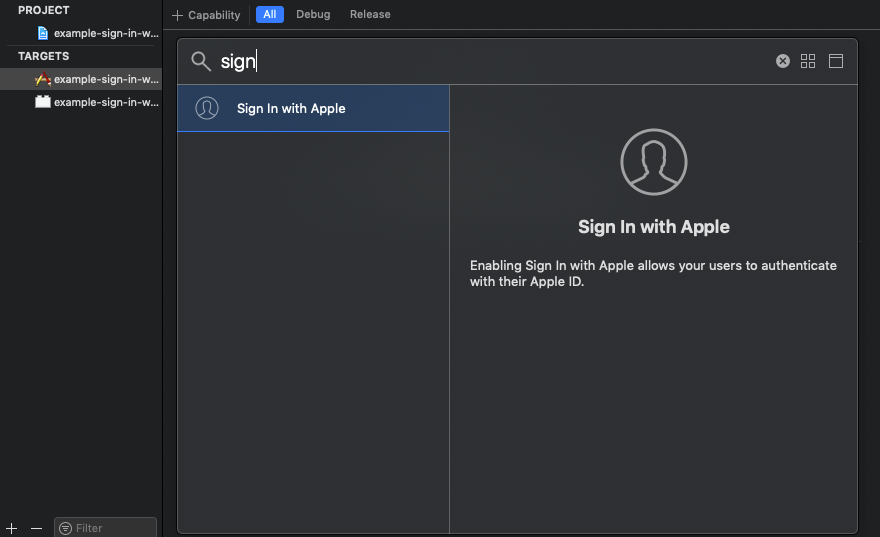

# Sign in with Apple
# Please Notic that this whole page is a copy-paste from references
## References
[Sign in with Apple Tutorial, Part 1: Apps](https://sarunw.com/posts/sign-in-with-apple-1/)

[Sign in with Apple Tutorial, Part 2: Private Email Relay Service](https://sarunw.com/posts/sign-in-with-apple-2/#fnref2)

[Sign in with Apple Tutorial, Part 3: Backend – Token verification](https://sarunw.com/posts/sign-in-with-apple-3/)

[Sign in with Apple Tutorial, Part 4: Web and Other Platforms](https://sarunw.com/posts/sign-in-with-apple-4/)

----

<small><i><a href='http://ecotrust-canada.github.io/markdown-toc/'>Table of contents generated with markdown-toc</a></i></small>

----

**Please notice this whole page is a copy-paste from references. We made the copy is because it's not very easy to open the references pages.**

## Sign in with Apple Tutorial, Part 1: Apps

Apple reveals Sign in with Apple[[1](https://developer.apple.com/sign-in-with-apple/)], a privacy and security focus login service, to the world at WWDC 2019. Apple told us it is mandatory for all apps using other third-party login services, but not much detail back then.

On September 12, 2019, they published a public announcement about guidelines for Sign in with Apple[[2](https://developer.apple.com/news/?id=09122019b)]. Here are the highlights.

> New apps submitted to the App Store must follow these guidelines. Existing apps and app updates must follow them by April 2020.

If you are reading this and not yet releasing your app, you might need to consider the following guideline.

> 4.8 Sign in with Apple
Apps that exclusively use a third-party or social login service (such as Facebook Login, Google Sign-In, Sign in with Twitter, Sign In with LinkedIn, Login with Amazon, or WeChat Login) to set up or authenticate the user’s primary account with the app must also offer Sign in with Apple as an equivalent option. A user’s primary account is the account they establish with your app for the purposes of identifying themselves, signing in, and accessing your features and associated services.
>
> Sign in with Apple is not required if:
>
> - Your app exclusively uses your company’s own account setup and sign-in systems.
> - Your app is an education, enterprise, or business app that requires the user to sign in with an existing education or enterprise account.
> - Your app uses a government or industry-backed citizen identification system or electronic ID to authenticate users.
> - Your app is a client for a specific third-party service and users are required to sign in to their mail, social media, or other third-party account directly to access their content.

In the end, no matter new or old, you might end up having this Sign in with Apple in your app, so let's get used to it.

### Why Sign in with Apple?
Sign in with Apple is the Apple way for users to set up an account and start using your apps and websites. They promise fast, secure, and privacy-friendly experiences. Let's see if they can live up to their promise.

### Capability
The first thing you need to do is add the new capability, Sign in with Apple. To do that click your app target > Signing & Capabilities tab > Click + Capability > Double click on "Sign in with Apple".



### The Button
Apple is very serious about their branding. They provide a dedicate class for their button, `ASAuthorizationAppleIDButton`[[3](https://developer.apple.com/documentation/authenticationservices/asauthorizationappleidbutton)]. To create a button, you just initialize and use it like a normal `UIButton`, nothing fancy here.
```swift
let button = ASAuthorizationAppleIDButton()
button.center = view.center
view.addSubview(button)
```

### Button Size and Position
You can't manually adjust the font size of Sign in with Apple button. You can just change the frame of the button, and the font size will adapt accordingly.


You might expect the font size getting bigger as frame expands, but as you can see, there is some weird behavior when size is 130x100 (the square one in the center) where the size is bigger, but font getting smaller.

So, my suggestion would be, start the design with Sign in with Apple button (so you know the font size) and then layout the rest of your alternative Sign in buttons.

### Button Light and Dark
Sign in button isn't adapt to light and dark mode change by default. You have to handle this by yourself.

```swift
override func traitCollectionDidChange(_ previousTraitCollection: UITraitCollection?) {
    super.traitCollectionDidChange(previousTraitCollection)
    
    let hasUserInterfaceStyleChanged = traitCollection.hasDifferentColorAppearance(comparedTo: previousTraitCollection)
    
    if hasUserInterfaceStyleChanged {
        setupProviderLoginView()
    }
}

func setupProviderLoginView() {
    // Remove the old button from container
    switch traitCollection.userInterfaceStyle {
    case .dark:
        authorizationButton = ASAuthorizationAppleIDButton(type: .default, style: .white)
    default:
        authorizationButton = ASAuthorizationAppleIDButton(type: .default, style: .black)
    }
    // Replace it with a new one we just created
    ...
}
```

### Corner radius
The last thing you can modify with the button is a corner radius. You can adjust to match the appearance of other buttons in your app.
```swift
button.cornerRadius = 0
```

After we have the button in place, if you run the app and try to tap the button, nothing will happen. That's because `ASAuthorizationAppleIDButton` is just a button, a simple view with no logic; you have to add target-action yourself like a normal button.

### Action
You add an action like usual.
```swift
authorizationButton.addTarget(self, action: #selector(handleAuthorizationAppleIDButtonPress), for: .touchUpInside)
```

Apple does all the hard work and packs everything in `ASAuthorizationController`, which will handle all the UI and presentation logic. The only thing we need to do in action is specify information you need via `ASAuthorizationAppleIDRequest`, which you can create from `ASAuthorizationAppleIDProvider` and put it as a parameter to `ASAuthorizationController`.

In the following example, we requested both `email` and `fullName`.
```swift
@objc
func handleAuthorizationAppleIDButtonPress() {
    let appleIDProvider = ASAuthorizationAppleIDProvider()
    let request = appleIDProvider.createRequest()
    request.requestedScopes = [.fullName, .email]
    
    let authorizationController = ASAuthorizationController(authorizationRequests: [request])
    authorizationController.delegate = self
    authorizationController.presentationContextProvider = self
    authorizationController.performRequests()
}
```

`presentationContextProvider` (ASAuthorizationControllerPresentationContextProviding) ask for one thing, a `window` to present sign in dialog.
```swift
// MARK: - ASAuthorizationControllerPresentationContextProviding
func presentationAnchor(for controller: ASAuthorizationController) -> ASPresentationAnchor {
    return self.view.window!
}
```

`delegate` (ASAuthorizationControllerDelegate) has two methods that will call when sign-in is a success and fail.
```swift
// MARK: - ASAuthorizationControllerDelegate
func authorizationController(controller: ASAuthorizationController, didCompleteWithAuthorization authorization: ASAuthorization) {
    if let appleIDCredential = authorization.credential as? ASAuthorizationAppleIDCredential {        
        guard let appleIDToken = appleIDCredential.identityToken else {
            print("Unable to fetch identity token")
            return
        }
        
        guard let idTokenString = String(data: appleIDToken, encoding: .utf8) else {
            print("Unable to serialize token string from data: \(appleIDToken.debugDescription)")
            return
        }
                
        let userIdentifier = appleIDCredential.user
        let fullName = appleIDCredential.fullName
        let email = appleIDCredential.email
        ...
    }
}

func authorizationController(controller: ASAuthorizationController, didCompleteWithError error: Error) {
    // Handle error.    
    guard let error = error as? ASAuthorizationError else {
        return
    }

    switch error.code {
    case .canceled:
        print("Canceled")
    case .unknown:
        print("Unknown")
    case .invalidResponse:
        print("Invalid Respone")
    case .notHandled:
        print("Not handled")
    case .failed:
        print("Failed")
    @unknown default:
        print("Default")
    }
}
```

This is about everything you need to do to integrate Sign in with Apple in your app. You can tap the sign-in button now and see it in action.

The sign-in flow is quite simple; let's have a quick look at what can happen when you tap the button.

### No Apple ID
If the device has no Apple ID `authorizationController(controller: ASAuthorizationController, didCompleteWithError error: Error)` will be called with a `ASAuthorizationErrorUnknown`.

You don't have to do anything about this. System alert will show guiding users to sign in.


To sign in to an app or website that offers Sign in with Apple, you need:
- An Apple ID that uses two-factor authentication.
- To be signed in to iCloud with this Apple ID on your Apple device.
See [How to use Sign in with Apple](https://support.apple.com/en-us/HT210318)

### First time
If users already signed in, for the first time, they will see Data and privacy information screen.


You would get `ASAuthorizationErrorCanceled` if they cancel, tap Continue would bring them to sign in screen.

Every sign in requests in a simulator is treated as the first time, so you will see this dialog every time if you test in a simulator.

### Grant
In sign-in screen, users will be presented with a form, prefilled with full name and email that registered with Apple account.

It can be email, full name, or both based on your requested scopes at the very beginning.

```swift
let appleIDProvider = ASAuthorizationAppleIDProvider()
let request = appleIDProvider.createRequest()
request.requestedScopes = [.fullName, .email]
```

, email(Middle), and both email and full name(Right)")

Users have options to edit both name and email.

Users can edit their name by tapping on them.


For email, they can choose to use any email associated with their Apple account (if they got more than one).


They can choose to hide their email by selecting "Hide my email" option, which will create an anonymous email address for users (a random string with @privaterelay.appleid.com).

Private relay email addresses have the following characteristics:
- They end in @privaterelay.appleid.com.
- They route emails to one of the Apple ID’s verified email addresses.
- They’re the same for a user across all apps written by a single development team, and different for the same user across apps written by different development teams.
- They’re active whether or not the user is signed into a device, and whether or not your app is installed on the device. You may send and receive email to the private email address at any time.

After the user has shared a private relay email address with your app, they can find, view, and manage it in their account settings at Settings > Apple ID > Password & Security > Apple ID Logins/App Using Your Apple ID > Your app name. They can see their assigned anonymous email there.

You can also manage this on website by visit your Apple ID > click Manage Apps & websites using Apple ID under Security section > Your app name.

After they choose their preference and continue, there are no extra steps.

### Done
Once signed in complete, you will get notified via `authorizationController(controller: ASAuthorizationController, didCompleteWithAuthorization authorization: ASAuthorization)` delegate where you can get user information from `authorization: ASAuthorization` object.

You can retrieve `fullName`, `email`, `user`, and `identityToken` from the object.
```swift
func authorizationController(controller: ASAuthorizationController, didCompleteWithAuthorization authorization: ASAuthorization) {
    if let appleIDCredential = authorization.credential as? ASAuthorizationAppleIDCredential {        
        guard let appleIDToken = appleIDCredential.identityToken else {
            print("Unable to fetch identity token")
            return
        }
        
        guard let idTokenString = String(data: appleIDToken, encoding: .utf8) else {
            print("Unable to serialize token string from data: \(appleIDToken.debugDescription)")
            return
        }
        
        
        let userIdentifier = appleIDCredential.user
        let fullName = appleIDCredential.fullName
        let email = appleIDCredential.email
        
        print(idTokenString)
        print(userIdentifier)
        print(fullName)
        print(email)  
    } 
}
```

### Pitfall
In the simulator, you can test Sign in with Apple many times as you want, and you would get everything (`fullName`, `email`, `user`, and `identityToken`) return in `authorizationController(controller: ASAuthorizationController, didCompleteWithAuthorization authorization: ASAuthorization)`, but when you test on real device, this won't be the case.

If you test this on a device, once you grant the permission (on any devices or simulator with the same Apple ID), the subsequence sign in would prompt the user with this dialog instead.


Tap Continue would result in a call on success delegate method, BUT full name and email won't be returned in `ASAuthorization`.

You can only retrieve the full name and email for the first time. If these are the required information for your registration process, make sure you save it before begin your registration process and remove it once your registration is confirmed.

This behavior is confirmed from Apple staff here [https://forums.developer.apple.com/thread/121496#379297](https://forums.developer.apple.com/thread/121496#379297)

> This behaves correctly, user info is only sent in the ASAuthorizationAppleIDCredential upon initial user sign up. Subsequent logins to your app using Sign In with Apple with the same account do not share any user info and will only return a user identifier in the ASAuthorizationAppleIDCredential. It is recommened that you securely cache the initial ASAuthorizationAppleIDCredential containing the user info until you can validate that an account has succesfully been created on your server.
> – Patrick

So, the code in authorizationController(controller: `ASAuthorizationController, didCompleteWithAuthorization authorization: ASAuthorization)` should be something like this:
```swift
func authorizationController(controller: ASAuthorizationController, didCompleteWithAuthorization authorization: ASAuthorization) {
    if let appleIDCredential = authorization.credential as? ASAuthorizationAppleIDCredential {        
        guard let appleIDToken = appleIDCredential.identityToken else {
            print("Unable to fetch identity token")
            return
        }
        
        guard let idTokenString = String(data: appleIDToken, encoding: .utf8) else {
            print("Unable to serialize token string from data: \(appleIDToken.debugDescription)")
            return
        }
        
        
        let userIdentifier = appleIDCredential.user
        let fullName = appleIDCredential.fullName
        let email = appleIDCredential.email
        
        // Save a full name and email since you can't retrieve it later, e.g., save it in the key chain
        // Create an account in your system.
        // On success, remove the key
        // On fail, recover full name and email from the keychain and retry registration
    } 
}
```
### Testing
If you want to test sign in like the first time (and receive full name and email), you can do that by removing the permission in Settings > Apple ID > Password & Security > Apple ID Logins/App Using Your Apple ID > Your app name > Stop using Apple ID

You can also manage this on website by visit your Apple ID > click Manage Apps & websites using Apple ID under Security section > Your app name > Stop using Apple ID

This might be the only solution we can give to users if something went wrong.

### Conclusion
I think the sign-in experience from Apple is very pleasant. Apple tries to ask as few data as possible and provide a built-in way to hide sensitive information like email. This is rarely seen in other sign-in services where they try to get as much data as they can. They delivered what they promised if you ask me.

These are everything you need to do for the client-side, but this is just one part of the whole sign-in process.

Right now, If you try sending an email to an anonymous email that you got from Apple (the one you received when you choose "Hide my email" option), it won't reach your primary email yet. We need a few steps to whitelist domains and emails that can communicate with our users. We will try to tackle this in part two of the series.

## Sign in with Apple Tutorial, Part 2: Private Email Relay Service
When you request email information from users, Sign in with Apple present them with two options:
1. Share My Email; this will share user's personal email address. This is like other sign-in services out there.
2. Hide My Email; this will create a unique, random address for users. This is an option we will focus on today.


### Hide My Email
Private relay email addresses have the following characteristics:
- This address is unique to you and the developer and follows this format: <unique-alphanumeric-string>@privaterelay.appleid.com.
- Any messages sent to this address by the app or website developer are automatically forwarded to your personal email address by our private email relay service.
- They’re the same for a user across all apps written by a single development team, and different for the same user across apps written by different development teams.
- They’re active whether or not the user is signed into a device, and whether or not your app is installed on the device. You may send and receive email to the private email address at any time.
- You can read and respond directly to these emails and still keep your personal address private.
The following is a random email address given:
```swift
dpdcnf87nu@privaterelay.appleid.com
```

If you are testing on Xcode, you can print this information out in success delegate.
```swift
func authorizationController(controller: ASAuthorizationController, didCompleteWithAuthorization authorization: ASAuthorization) {
    if let appleIDCredential = authorization.credential as? ASAuthorizationAppleIDCredential {        
        guard let appleIDToken = appleIDCredential.identityToken else {
            print("Unable to fetch identity token")
            return
        }
        
        guard let idTokenString = String(data: appleIDToken, encoding: .utf8) else {
            print("Unable to serialize token string from data: \(appleIDToken.debugDescription)")
            return
        }
        
        
        let userIdentifier = appleIDCredential.user
        let fullName = appleIDCredential.fullName
        let email = appleIDCredential.email
        
        print(email)  
    } 
}
```

If you test on a real device, you can view it in Settings > Apple ID > Password & Security > Apple ID Logins/App Using Your Apple ID > Your app name (Under HIDE MY EMAIL section).


### Do users need to know about this email?
It seems hard to retrieve this email, but that shouldn't be a problem. This email should act as a read-only for users. We use this email to send the necessary information to users, such as verification links and news.

### Can users use this email elsewhere?
No, only the whitelist email domain can send and receive email from this anonymous email. You can try sending email to anonymous email, and nothing will reach your Apple ID's verified email addresses.

### Register Your Email Domain
Since the anonymous email can't send or receive any email except the one that registered with Apple, this is the first thing you need to do.

To send emails to users with private email addresses, you must register your outbound email (__Outbound email is an email sent by you(developers).__) domains. All registered domains must create Sender Policy Framework (SPF)(__Spammers might send emails that appear to come from your domain. This is called spoofing. You can add a Sender Policy Framework (SPF) record to your domain host to help your recipients know where emails from your domain should be coming from and that they aren't spoofed. https://support.google.com/a/answer/33786?hl=en, https://en.wikipedia.org/wiki/Sender_Policy_Framework__) DNS TXT records in order to transit Apple's private mail relay. These mechanisms ensure that only you can communicate with your users through this channel, and they prevent spam from getting through.

You might never hear of these terms and jargon, but the process is easier than you think. Let's begin.

### Register Domains with Apple
1. In Certificates, Identifiers & Profiles, select More from the sidebar, and click Configure Sign in with Apple.


2. In the "Domains and Associated Email Addresses" section, enter your domain name, and click Register.

    Registration will fail if the domain does not publish an SPF DNS TXT record.

    **Where can I get SPF for my domain?**

    This process is vary based on where would you like to send your email from (G Suite, Mailchimp, etc.). In my case, I use G Suite. If you are also using Google to sending an email you can follow the same instruction https://support.google.com/a/answer/33786?hl=en

    After you know the sender, it is just a matter of adding TXT record to your domain. Something like this:

        v=spf1 include:_spf.google.com ~all

3. Once registered, click Download, place the downloaded file (`apple-developer-domain-association.txt`) in the specified location (`https://example.com/.well-known/apple-developer-domain-association.txt`), then click Verify.


4. A green checkmark will appear when the domain has passed verification and is registered to your account.


All email addresses associated with your registered domains will be able to send and receive messages to and from customers using Apple’s private email relay service.

If you don't want that, you can also add individual email addresses one by one.

### Register Communication Emails
1. In Certificates, Identifiers & Profiles, select More from the sidebar, and click Configure Sign in with Apple.
2. In "Individual Email Addresses" section, enter the email address you will use to contact your customers and click Register. Registration will fail if the domain does not publish an SPF DNS TXT record.
3. A green checkmark will appear when the email domain has passed validation and is registered to your account.
